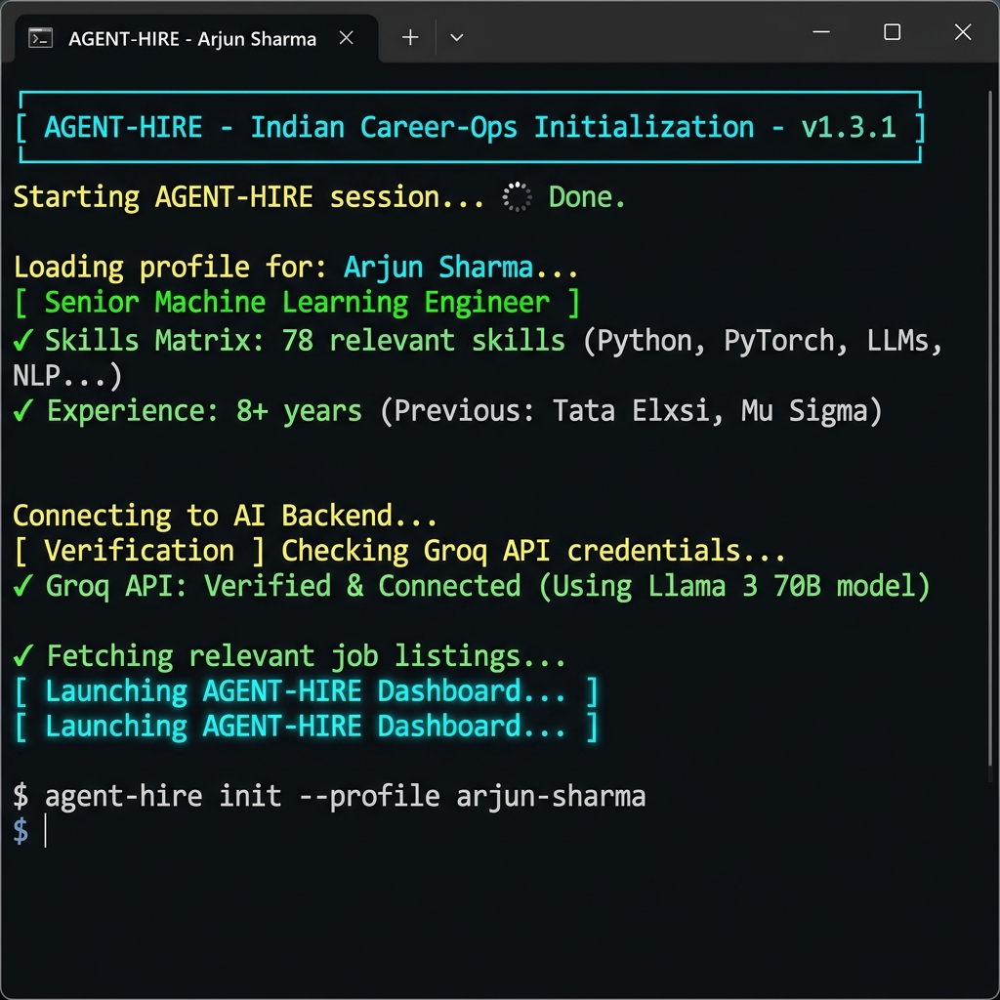
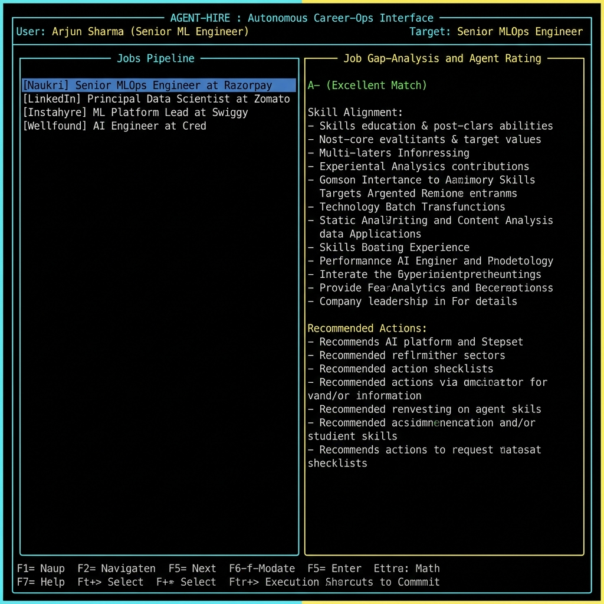
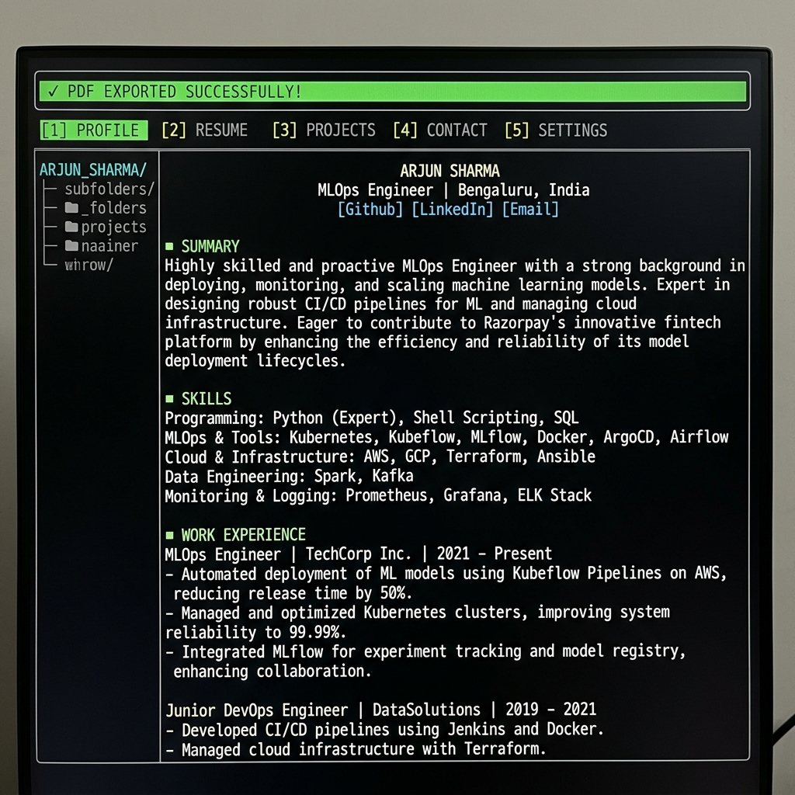
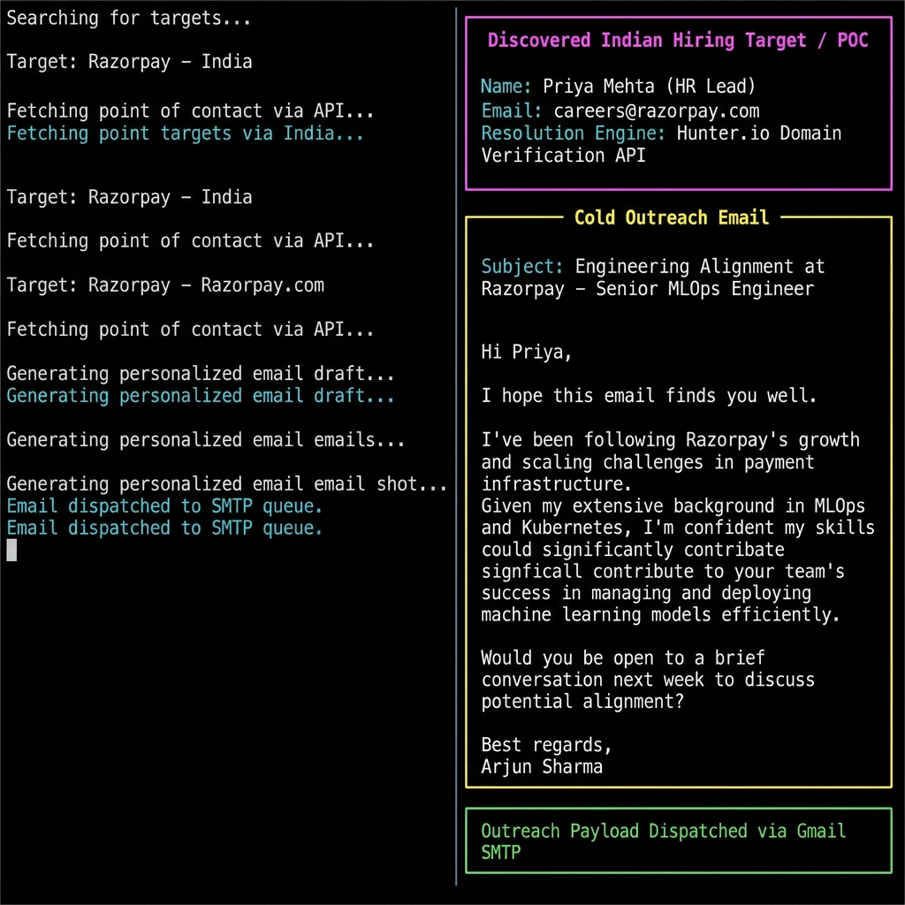

# ⚡ Jobs-A2Z — Autonomous Career-Ops Agent

> An enterprise-grade, agentic AI platform that automates the entire Indian tech job hunt — from live scraping to personalized outreach — powered by a **pluggable AI brain** (Gemini · OpenAI · Groq · Ollama) and **multi-provider SMTP dispatch** (Gmail · Outlook · Yahoo · SendGrid · Mailgun · Zoho).

[](https://nodejs.org/)
[](https://aistudio.google.com/)
[](https://platform.openai.com/)
[](https://console.groq.com/)
[](https://ollama.com/)
[](https://playwright.dev/)
[](LICENSE)

---

## 🌟 What is Jobs-A2Z?

**Jobs-A2Z** is a fully autonomous, terminal-based career operations platform built specifically for the **Indian tech job market**. Instead of manually browsing Naukri, LinkedIn, Instahyre, and Wellfound every day — this agent does it all for you in a single keystroke.

It scrapes live listings, evaluates each role against your CV, drafts ATS-optimized tailored resumes, discovers recruiter contacts, writes hyper-personalized cold emails, and dispatches them — all from a sleek TUI dashboard. The AI brain and email dispatch are fully **pluggable**: use Google Gemini, OpenAI GPT-4o, Groq's free LLaMA 3, or even a fully offline local Ollama model. Send emails over Gmail, Outlook, Yahoo, SendGrid, Mailgun, Zoho, or any custom SMTP server.

---

## 🧠 Architecture Overview

```
┌─────────────────────────────────────────────────┐
│          Onboarding Setup (CLI Prompts)          │
│  Name → Designation → CV → Auth → Target Role   │
└───────────────────┬─────────────────────────────┘
                    │
                    ▼
┌─────────────────────────────────────────────────┐
│         Playwright Web Scraper Engine            │
│  Naukri · LinkedIn · Instahyre · Wellfound       │
└───────────────────┬─────────────────────────────┘
                    │
                    ▼
┌─────────────────────────────────────────────────┐
│       Blessed TUI Master Dashboard               │
│  Jobs Pipeline · Eval · Resume · Logs tabs       │
└───────────────────┬─────────────────────────────┘
                    │
         ┌──────────┼──────────┐
         ▼          ▼          ▼
    [Enter]        [R]        [P]
  Gemini Eval   AI Resume   ATS PDF
                            Export
                    │
              ┌─────┴──────┐
              ▼            ▼
             [C]          [A]
        Contact +     Full Auto-Pilot
        Cold Email    (All steps at once)
```

---

## 📸 How It Works — Visual Walkthrough

> *Demo profile: **Arjun Sharma**, Senior ML Engineer, hunting for **Senior MLOps Engineer** roles across Indian unicorns.*

### Step 1 — Smart Startup (Skips Onboarding After First Run)

On first launch you fill in your name, designation, and target role once. Every subsequent `node index.js` detects your saved profile and jumps straight to the dashboard.



---

### Step 2 — Live Jobs Dashboard (4-Portal Real-Time Scraping)

The left panel populates with live opportunities scraped from **Naukri, LinkedIn India, Instahyre,** and **Wellfound** — all specifically matching your target role. Press `Enter` to trigger AI gap-analysis.



---

### Step 3 — AI Resume Tailoring + ATS PDF Export

Press `[R]` to have the AI rewrite your CV specifically for the selected job. Press `[P]` to instantly render it into a professional ATS-optimized PDF via headless Chromium.



---

### Step 4 — Recruiter Contact Discovery + Automated Cold Outreach

Press `[C]` to discover the hiring manager's contact, draft a personalized cold email, and dispatch it over SMTP with your PDF attached. Press `[A]` to run all steps autonomously in one keystroke.



---

## 🚀 Key Features

| Feature | Description |
|---|---|
| 🔍 **Live Job Scraping** | Playwright Chromium bypasses bot protection and scrapes real listings from Naukri, LinkedIn India, Instahyre, and Wellfound |
| 🧠 **Multi-Provider AI Brain** | Pluggable AI router: Gemini REST, OpenAI GPT-4o, Groq LLaMA 3 (free), Ollama (local), or Gemini CLI — auto-fallback chain |
| ✍️ **Tailored Resume Drafting** | AI generates a fully customized resume for each specific job description |
| 📄 **ATS-Optimized PDF Export** | Headless Chromium renders your resume into a professional, parser-friendly PDF |
| 🎯 **Recruiter Contact Discovery** | Hunter.io / Apollo.io APIs + algorithmic fallback to find real hiring manager emails |
| ✉️ **Multi-Provider Email Dispatch** | Gmail, Outlook, Yahoo, SendGrid, Mailgun, Zoho, or custom SMTP — automatically selects from `.env` config |
| 🤖 **Full Auto-Pilot Arc** | One key `[A]` executes the entire pipeline end-to-end autonomously |
| 🔬 **Glass-Box Observability** | Real-time logs tab streams all agent events, cache hits, and scraper progress |
| 💾 **Agent Diaries Caching** | LLM results are cached locally to avoid redundant API calls and reduce cost |

---

## 📋 Prerequisites

Before installing, ensure you have the following:

- **Node.js** v18 or higher — [Download](https://nodejs.org/)
- **npm** (comes with Node.js)
- **At least one AI provider key** (Gemini, OpenAI, Groq — or run Ollama locally for free)
- **An email account** for outreach dispatch (Gmail, Outlook, Yahoo, SendGrid, etc.)
- **Git** installed and configured

---

## 🛠️ Installation

### 1. Clone the Repository

```bash
git clone https://github.com/swapwarick/Jobs-A2Z.git
cd Jobs-A2Z
```

### 2. Install Dependencies

```bash
npm install
```

### 3. Install Playwright Chromium Browser

```bash
npx playwright install chromium
```

### 4. Create your CV Profile

Create a file named `cv.md` in the project root and paste your resume/profile in Markdown format:

```bash
# Your Full Name
## Professional Summary
5+ years of experience in...

## Skills
- Node.js, React, Python...

## Experience
...
```

> This file is gitignored and stays 100% local to your machine.

### 5. Configure Environment Variables

Create a `.env` file in the project root. Only fill in the providers you want to use — everything else will auto-fallback:

```env
# ── AI PROVIDER (auto | gemini | openai | groq | ollama) ──────────
AI_PROVIDER=auto

# Google Gemini REST API — https://aistudio.google.com/app/apikey
GEMINI_API_KEY=
GEMINI_MODEL=gemini-2.0-flash

# OpenAI GPT — https://platform.openai.com/api-keys
OPENAI_API_KEY=
OPENAI_MODEL=gpt-4o-mini

# Groq (FREE tier, ultra-fast) — https://console.groq.com/keys
GROQ_API_KEY=
GROQ_MODEL=llama-3.3-70b-versatile

# Ollama (local, offline, free) — https://ollama.com
OLLAMA_URL=http://localhost:11434
OLLAMA_MODEL=llama3

# ── EMAIL DISPATCH (gmail | outlook | yahoo | sendgrid | zoho | custom)
SMTP_PROVIDER=gmail
SMTP_USER=your.email@gmail.com
SMTP_PASS=your16charapppassword

# ── CONTACT DISCOVERY (optional)
HUNTER_API_KEY=
APOLLO_API_KEY=
```

---

## ▶️ Running the Application

```bash
node index.js
```

You will be walked through a **5-step onboarding setup**:

```
================================================================
       ⚡ AGENT-HIRE : Indian Career-Ops Initialization
================================================================

👤 Enter your Name: Swapnil Netankar
💼 Enter your Current Designation/Headline: AI Infrastructure Engineer
📄 Base Profile loaded from ./cv.md (4316 characters)
✍️  Append specific focus/skills to resume? (Leave blank to keep base CV):

🔐 Initializing Google Gemini Agentic Cloud Authentication...
✅ Verified local OAuth / Environment Key access for Gemini.

🎯 Target Scrape Arc Pipeline Configuration
🔍 Enter specific Job Role to hunt: Senior MLOps Engineer

✅ Configured live scrapers on 4 regional portals targeting: "Senior MLOps Engineer"
🚀 Launching visual Master TUI Dashboard in 2 seconds...
```

---

## 🎮 Dashboard Controls

Once the TUI dashboard loads, use these keyboard shortcuts:

| Key | Action |
|---|---|
| `↑` / `↓` | Navigate the jobs list (left panel) |
| `←` / `→` | Switch focus between Jobs list and Workspace panel |
| `Tab` | Toggle panel focus |
| `Enter` | **Evaluate** selected job via Gemini AI |
| `R` | **Draft tailored resume** for selected job |
| `P` | **Export ATS-optimized PDF** of the tailored resume |
| `C` | **Discover recruiter contact** and draft + send cold email |
| `A` | **Full Auto-Pilot Arc** — runs all steps end-to-end autonomously |
| `S` | **Rescan** all portals for fresh listings |
| `1` | Switch to Evaluation tab |
| `2` | Switch to Tailored Resume tab |
| `3` | Switch to Base CV tab |
| `4` | Switch to Logs tab |
| `Q` / `Esc` | Exit the dashboard |

---

## 🔄 The Autonomous Arc Workflow (`[A]` key)

Pressing `[A]` on any job listing triggers the complete end-to-end pipeline:

```
Phase 1: 🧠 AI evaluates job vs. your CV (gap analysis + match score)
           └─ Uses: Gemini → OpenAI → Groq → Ollama → Gemini CLI
Phase 2: ✍️  AI drafts a customized tailored resume for this exact role
Phase 3: 📄 Headless Chromium renders a clean ATS-optimized PDF
Phase 4: 🎯 Hunter/Apollo (or smart fallback) resolves recruiter email
Phase 5: ✉️  AI writes cold outreach email
Phase 6: ✉️  Dispatches via configured SMTP provider (or spools to ./outbox/)
```

If SMTP credentials are not configured, the email payload is safely **spooled locally** to the `./outbox/` directory.

---

## 🔌 Provider Configuration

### 🧠 AI Brain Providers

Set `AI_PROVIDER=` in your `.env` to force a specific provider, or leave as `auto` to use the automatic fallback chain:

| Provider | `AI_PROVIDER` value | Speed | Cost | Requires |
|---|---|---|---|---|
| **Gemini REST API** | `gemini` | ⚡ Fast | Free / Pay-as-go | `GEMINI_API_KEY` |
| **OpenAI GPT-4o** | `openai` | ⚡ Fast | Paid | `OPENAI_API_KEY` |
| **Groq LLaMA 3** | `groq` | 🚀 Fastest | **Free tier** | `GROQ_API_KEY` |
| **Ollama (Local)** | `ollama` | Moderate | **100% Free** | Local install |
| **Gemini CLI** | *(fallback)* | Slow | Free | OAuth session |

> 💡 **Groq is the recommended free option** — get your key in 30 seconds at [console.groq.com](https://console.groq.com/keys) with Google login. No credit card required.

### ✉️ Email (SMTP) Providers

Set `SMTP_PROVIDER=` in your `.env` — no other host/port config needed:

| Provider | `SMTP_PROVIDER` value | Notes |
|---|---|---|
| **Gmail** | `gmail` | Requires [App Password](https://myaccount.google.com/apppasswords) |
| **Outlook / Hotmail** | `outlook` | Use your Microsoft account password |
| **Yahoo Mail** | `yahoo` | Requires Yahoo App Password |
| **SendGrid** | `sendgrid` | Set `SENDGRID_API_KEY` — best for bulk sending |
| **Mailgun** | `mailgun` | Good for transactional emails |
| **Zoho Mail** | `zoho` | Popular with Indian businesses |
| **Office 365** | `office365` | Microsoft 365 Business accounts |
| **Custom SMTP** | `custom` | Also set `SMTP_HOST` and `SMTP_PORT` |

> 💡 If no SMTP is configured, all outreach emails are safely saved to `./outbox/` as text files for manual review.

---

## 📁 Project Structure

```
Jobs-A2Z/
├── index.js          # Main TUI dashboard + onboarding setup
├── agent.js          # Multi-provider AI skills (eval, resume, email, SMTP)
├── scan.js           # Playwright web scraper for Indian job portals
├── auth.js           # Gemini CLI authentication helper
├── portals.yml       # Job portal configuration (auto-updated on launch)
├── package.json      # Project dependencies
├── .gitignore        # Protects .env, cv.md, PDFs from being committed
└── README.md         # This file
```

---

## 🔒 Privacy & Security

The following files are **permanently gitignored** and will **never be committed** to GitHub:

- `.env` — Your SMTP credentials and API keys
- `cv.md` — Your personal resume profile
- `*.pdf` — All generated ATS resume documents
- `outbox/` — Local email spool records
- `.agent-diaries/` — Local AI response cache

---

## 🧩 Tech Stack

| Layer | Technology |
|---|---|
| **Terminal UI** | [Blessed](https://github.com/chjj/blessed) + [Blessed-Contrib](https://github.com/yaronn/blessed-contrib) |
| **Web Scraping** | [Playwright](https://playwright.dev/) (Chromium) |
| **AI Brain** | [Gemini REST](https://ai.google.dev/) · [OpenAI SDK](https://github.com/openai/openai-node) · [Groq SDK](https://console.groq.com/) · [Ollama](https://ollama.com/) · [Gemini CLI](https://github.com/google-gemini/gemini-cli) |
| **PDF Generation** | Playwright headless + [Marked](https://marked.js.org/) (Markdown → HTML → PDF) |
| **Email Dispatch** | [Nodemailer](https://nodemailer.com/) — Gmail · Outlook · Yahoo · SendGrid · Mailgun · Zoho · Custom |
| **LLM Caching** | [Agent-Diaries](https://www.npmjs.com/package/agent-diaries) SDK |
| **Config** | YAML (`portals.yml`) + dotenv (`.env`) |

---

## 🤝 Contributing

Pull requests are welcome! For major changes, please open an issue first to discuss what you'd like to change.

1. Fork the repository
2. Create your feature branch: `git checkout -b feature/amazing-feature`
3. Commit your changes: `git commit -m 'feat: add amazing feature'`
4. Push to the branch: `git push origin feature/amazing-feature`
5. Open a Pull Request

---

## 📄 License

This project is licensed under the MIT License — see the [LICENSE](LICENSE) file for details.

---

<div align="center">

**Built with ❤️ for the Indian tech job market**

*Stop scrolling job boards. Let the agent hunt for you.*

</div>
